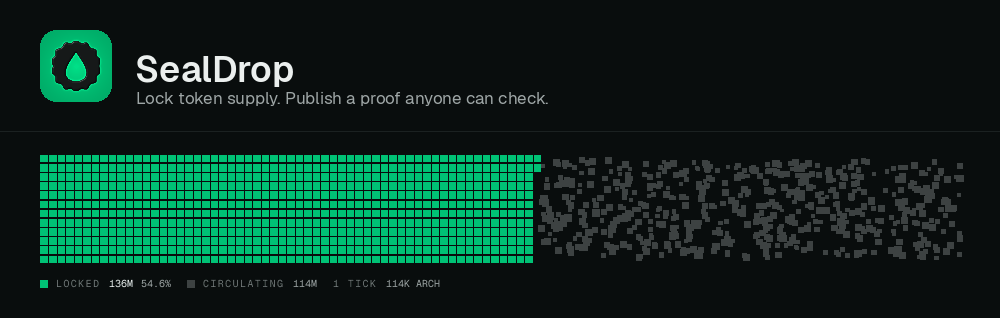
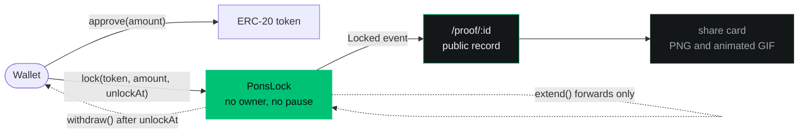
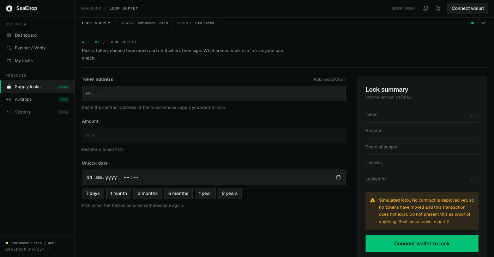
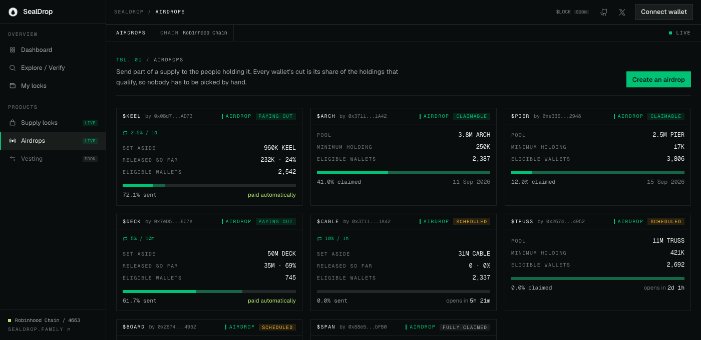
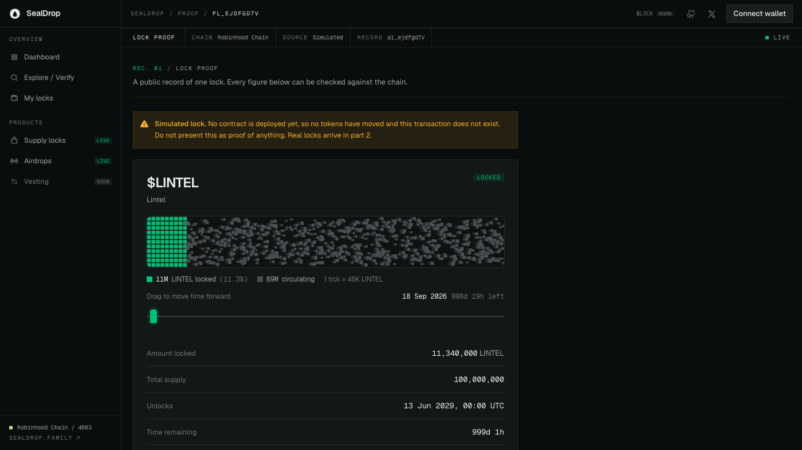
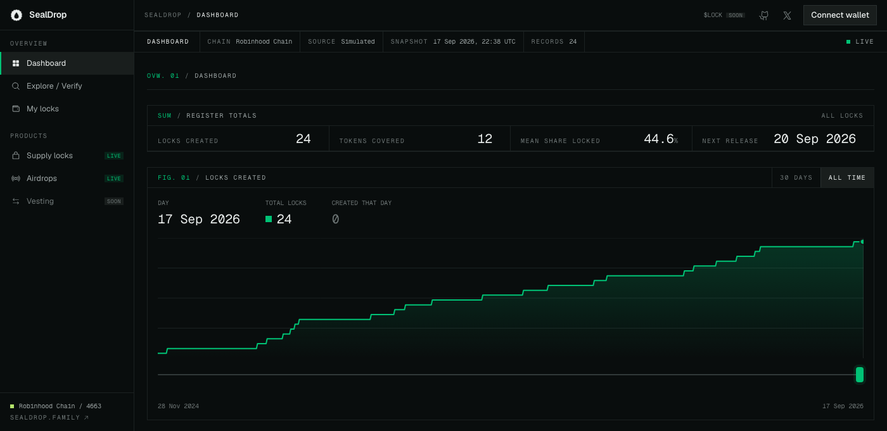

<div align="center">



<br>

**Lock a token's supply so nobody can move it, then publish a proof anyone can check.**

<br>

[](https://www.sealdrop.family/)
[](https://robinhoodchain.blockscout.com)
[](#live-contracts)
[](contracts/src)
[](web)
[](#testing)

<br>

[**Live site**](https://www.sealdrop.family/) &nbsp;·&nbsp;
[**What it is**](#what-it-is) &nbsp;·&nbsp;
[**The picture**](#the-picture-it-argues-with) &nbsp;·&nbsp;
[**Contracts**](#live-contracts) &nbsp;·&nbsp;
[**Run it**](#run-it) &nbsp;·&nbsp;
[**Drips**](#drips-a-giveaway-with-no-last-round) &nbsp;·&nbsp;
[**Testing**](#testing) &nbsp;·&nbsp;
[**Limits**](#what-is-not-done)

</div>

---

## What it is

Three contracts with no privileged address between them, and one app on top.

|   | What it does |
| --- | --- |
| 🔒 **Supply locks** | Holds ERC-20 supply until a date the locker chose. The date can be pushed out, never pulled in. |
| 🪂 **Airdrops** | Sets aside a pool and splits it across holders by Merkle proof, once. |
| 💧 **Drips** | Hands out a share of whatever is *left* on every interval, for ever. No final round. |

Every lock becomes a page at `/proof/<id>` that a stranger can open from a post, read without
a wallet, and check against the chain themselves.

> [!IMPORTANT]
> The app defaults to **fixtures, not the chain**. Every simulated lock is watermarked as such
> on screen and inside its share image, because a proof page that cannot tell you whether it
> describes a real lock is a rug-pull instrument. Set `NEXT_PUBLIC_LOCKS_ADAPTER=chain` to
> point it at the deployed contracts.

---

## The picture it argues with

The banner is the product's whole claim in one loop. The green block is locked supply and it
does not move. The grey field beside it is everything still circulating, and it never stops
drifting. Nothing in that image is decoration: the block is sized by the real locked share,
and one tick is a real quantity of tokens, printed in the legend under it.

It is a `<canvas>`, and the same positions are computed in plain TypeScript so the share image
can draw the identical picture on a server with no canvas and no GPU. Squares rather than
circles on purpose: a square reads as a discrete countable unit, a circle reads as gas.

<details>
<summary><b>Why it is not WebGL</b></summary>

<br>

WebGL's advantage is throughput, and there is nothing to throughput here: a few thousand
`fillRect` calls sit comfortably inside a frame budget. Its cost would be real, though. The
maths would have to exist twice, once in a shader and once in TypeScript for the server-side
share card, with no way to prove the two agree. A card that disagrees with the page it came
from is worse than a slower card.

The running animation renders the React tree exactly zero times. The loop reads MotionValues
and writes to the canvas directly.

</details>

---

## Live contracts

Deployed and holding bytecode on both chains. Every address below is a link.

### Robinhood Chain mainnet `4663`

| Contract | Address |
| --- | --- |
| `PonsLock` | [`0x5386FEb416b7867f97c7ca3CA6B10c22d26F71D7`](https://robinhoodchain.blockscout.com/address/0x5386FEb416b7867f97c7ca3CA6B10c22d26F71D7) |
| `PonsAirdrop` | [`0xAC2205d13316F5110C2bEE8Bb60c792608d46B2c`](https://robinhoodchain.blockscout.com/address/0xAC2205d13316F5110C2bEE8Bb60c792608d46B2c) |
| `PonsDrip` | [`0x0B2B9B3D465c28F198729661A1B09F113D2CDd26`](https://robinhoodchain.blockscout.com/address/0x0B2B9B3D465c28F198729661A1B09F113D2CDd26) |

### Robinhood Chain testnet `46630`

| Contract | Address |
| --- | --- |
| `PonsLock` | [`0x0B2B9B3D465c28F198729661A1B09F113D2CDd26`](https://explorer.testnet.chain.robinhood.com/address/0x0B2B9B3D465c28F198729661A1B09F113D2CDd26) |
| `PonsAirdrop` | [`0x74B04279dd9686FEF8E8F6a07A523bEab511504c`](https://explorer.testnet.chain.robinhood.com/address/0x74B04279dd9686FEF8E8F6a07A523bEab511504c) |
| `PonsDrip` | [`0xAa0183640A99490681B66eAc1b3fa7ee4A546ff8`](https://explorer.testnet.chain.robinhood.com/address/0xAa0183640A99490681B66eAc1b3fa7ee4A546ff8) |

### What they cannot do

There is no `Ownable`, no `onlyOwner`, no pause, no rescue and no `delegatecall` anywhere in
`contracts/src`. That is not a promise in a README, it is asserted by tests that fail if it
stops being true: `test_deployerHasNoPowerOverALock` and `test_deployerHasNoPowerOverAPool`.

| Escape hatch | Answer |
| --- | --- |
| Early exit | **None.** No function returns tokens before the unlock date. |
| Admin key over locked funds | **None.** Nobody can move, pause or redirect it. |
| Changing the unlock date | **Extend only.** A lock can only ever become stronger. |

A rescue function is an admin key wearing a different hat, so there isn't one.

---

## Run it

```bash
git clone <this repo> && cd SealDrop-RH

# the app, on fixtures
cd web
pnpm install
pnpm dev                 # http://localhost:3000

# the contracts
cd ../contracts
./deps.sh                # pinned forge-std v1.16.2 + openzeppelin v5.7.0
forge test               # 64 tests, including fuzz
```

<details>
<summary><b>Pointing the app at the real contracts</b></summary>

<br>

Create `web/.env.local`:

```bash
NEXT_PUBLIC_CHAIN_ID=46630          # 4663 for mainnet
NEXT_PUBLIC_LOCKS_ADAPTER=chain     # "mock" is the default
NEXT_PUBLIC_AIRDROPS_ADAPTER=chain  # airdrops have their own switch
```

Delete the file to go back to fixtures. Everything above `lib/locks/adapter.ts` is identical
between the two, which is what the seam is for: no hook and no component knows which one is
running.

`dev` and `build` both pass `--webpack`. RainbowKit's WalletConnect dependency chain does not
build under Turbopack ([rainbow-me/rainbowkit#2595](https://github.com/rainbow-me/rainbowkit/issues/2595)),
so HMR is slower than you may expect. That is the reason, not a fault.

</details>

<details>
<summary><b>Scripts worth knowing</b></summary>

<br>

| Command | What it does |
| --- | --- |
| `pnpm verify` | typecheck, lint, 228 tests, copy check, token check |
| `node scripts/e2e.mjs` | drives the whole flow in a browser against a forked node, 14 checks |
| `node scripts/check-responsive.mjs` | fails if any of 10 routes scrolls sideways at 320px |
| `node scripts/snapshot.mjs` | replays Transfers, rebuilds balances, writes the Merkle root |
| `node scripts/shoot.mjs <route>` | screenshots a route at desktop and phone width |
| `node scripts/capture-freeze.mjs <id>` | the freeze as a strip of frames, for judging timing |
| `node scripts/compare-og.mjs <id>` | the live canvas and the share image side by side |
| `python3 scripts/brand.py` | draws the mark, and every icon, favicon and logo variant from it |
| `python3 scripts/banner.py` | redraws the header on the animated banner at the top of this file |
| `node scripts/shoot-media.mjs` | re-shoots the four screenshots this file embeds |

</details>

---

## How a lock happens



<div align="center">

</div>

The summary on the right restates everything that is about to be signed. Its rows sit there
dashed out before they have a value, so the panel does not reflow as the form fills in.

---

## Drips: a giveaway with no last round

`PonsAirdrop` puts a pool on the table and everyone takes their cut once. `PonsDrip` takes a
percentage of whatever is **left** on every interval, so the same 5% is a smaller absolute
amount each time.

| Round | Reserve before | 5% released |
| ---: | ---: | ---: |
| 1 | 100,000 | 5,000 |
| 2 | 95,000 | 4,750 |
| 3 | 90,250 | 4,512 |
| … | … | … |

That geometry is deliberate. **A schedule that hands out a fixed slice has a last round, and a
known last round is a cliff that everyone sells into.** A schedule that takes a share of the
remainder has no last round, only rounds too small to matter.

Release is continuous rather than stepped: the round in flight counts pro rata through its
interval, so a holder who claimed a second ago is owed something again now.

<details>
<summary><b>Airdrop arithmetic, and the two bugs it is shaped to avoid</b></summary>

<br>

Each wallet's cut is `pool * balance / eligibleSupply`, where `eligibleSupply` is the sum of
the balances of every holder clearing the minimum.

**Split across qualifying holders, not total supply.** Measuring against total supply would
leave most of the pool unallocated, since locked supply and disqualified wallets can never
claim it. Measuring against qualifying balances means the pool is exactly distributed.

**The multiplication happens before the division.** Dividing first floors the ratio to zero
for any holder smaller than `eligibleSupply / pool`, which is most of them. Pinned by its own
test.

**Locked supply is excluded from the snapshot.** The first run against a real token found two
holders and one of them was `PonsLock`. Allocating an airdrop to a lock contract sends tokens
to an address with no way to claim them, and takes that share from the people the drop was
for. Burn addresses and this project's own contracts are excluded for the same reason.

**The terms freeze when claiming opens.** A creator can change the pool, the minimum and the
opening time, but only beforehand. Once a holder can act on the terms, moving them is a rug in
slow motion. Enforced in the adapter, not only in the UI, because a control that is merely
hidden is not a rule.

</details>

<div align="center">

</div>

---

## The proof page

<div align="center">

</div>

What a stranger opens from a post. No wallet needed, every figure checkable against the chain,
and the simulated banner at the top when it is not real.

`simulated: boolean` is non-optional and never defaulted anywhere in the codebase. Every
surface that presents a lock as fact says plainly when it is not one, including the share
image.

---

## Testing

```bash
cd contracts && ./deps.sh && forge test   # 64 tests
cd web && pnpm verify                     # typecheck, lint, 228 tests, copy + token checks
```

**292 tests total.** On top of those:

```bash
# a node forking testnet keeps the deployed contracts in state
anvil --fork-url https://rpc.testnet.chain.robinhood.com --chain-id 46630
node scripts/e2e.mjs                 # 14 checks, including a real lock written through the UI
node scripts/check-responsive.mjs    # no horizontal scroll at 320px, on all 10 routes
```

`e2e.mjs` drives the browser with an EIP-1193 stub that forwards every call to the node. It is
a genuine write: the app builds the transaction, the node runs real bytecode, and the
assertions read the result back off the chain rather than trusting the UI.

`contracts/test/CrossLanguageMerkle.t.sol` pins the TypeScript tree against the Solidity
verifier using a root and proofs generated by the snapshot tool and pasted in verbatim. A
mismatched implementation produces a perfectly well-formed root that rejects every claim, and
nothing else would catch it.

---

## Design

<div align="center">

</div>

One dark palette, **cleared emerald**: a slate ground leaning teal, cool hairlines, one emerald
accent, so the only thing on a page that reads as green is what is locked. It replaced the
original graphite-and-orange palette after a green, a blue and a gold candidate were built and
compared on the real landing page.

**The chart plots one measure on one axis, deliberately.** The obvious version draws a count
and a value together, which needs two y-scales, and a dual-axis chart is not a comparison: the
lines cross wherever the arbitrary scaling puts them, so every relationship it appears to show
is an artefact. A second measure would get a second chart.

<details>
<summary><b>Rules this repo enforces mechanically</b></summary>

<br>

`pnpm verify` is `tsc --noEmit && eslint && vitest run && check-copy && check-tokens`.

- **No em-dashes or en-dashes** anywhere in `app/`, `components/`, `lib/`. A build failure,
  not a preference.
- **No colour literals** outside `app/globals.css`. The only exceptions are `lib/skins.ts`,
  `lib/og/**` and `app/api/og/**`, because satori cannot read CSS custom properties.
- **No `window.addEventListener("scroll")`.** Use IntersectionObserver or Motion's `useScroll`.
- A new colour must survive `contrast.test.ts`, which demands 4.5:1 and CIE76 ΔE ≥ 20 against
  all five existing meaning colours.
- **New routes must be added** to `ROUTES` in `scripts/check-responsive.mjs` or the 320px
  check silently skips them.
- **ABIs and addresses are generated, never pasted.**
- **Brand assets are generated too**, by `python3 web/scripts/brand.py`, which draws the mark
  from geometry and reads the palette out of `lib/skins.ts`. There is no source image to edit.
  Rerun it after any change to `--fg`, `--bg` or `--accent`. See
  [`web/public/brand/README.md`](web/public/brand/README.md).
- **So is everything this file embeds.** `web/scripts/shoot-media.mjs` takes the four
  screenshots and `web/scripts/banner.py` redraws the banner's header, so a change to the
  chrome does not leave the README showing the previous design.
- bigint everywhere internally. Never `Number` for token amounts.

</details>

<details>
<summary><b>Two shells, one URL space</b></summary>

<br>

Routes are split by route group, so no URL changes.

`app/(site)/` is the public face: the landing page and every `/proof/[id]` link, under the
marketing header and footer. Proof pages live here on purpose. They are what a stranger opens
from a post, so they need a way back into the site, not a sidebar of controls that only mean
something with a wallet connected.

`app/(app)/` is the dashboard: `/dashboard`, `/lock`, `/explore`, `/me`, `/airdrops`, under a
fixed navigation rail. Below `lg` the rail becomes an overlay.

Sidebar entries that do not exist yet are shown disabled and labelled `SOON` rather than
linked. A greyed row is information; a link that 404s is a bug.

</details>

---

## Layout

```
contracts/   Foundry. PonsLock, PonsAirdrop, PonsDrip. No owner, no admin, no pause anywhere.
web/         Next.js 16, wagmi, viem, RainbowKit.
docs/        tokens.md (the design tokens), strip.md (how the supply strip is built)
```

---

## What is not done

Stated plainly, because a README that only lists wins is not describing a real repo.

- **No `LICENSE` file.** `contracts/src` carries mixed SPDX headers, some GPL-3.0-or-later
  and some MIT, and the web package declares none. The terms for reusing any of this are
  ambiguous until that is settled.
- **`contracts/README.md` still says `forge test # 39 tests`.** The suite is 64.
- **`web/.env.example` still frames the contracts as unshipped.** It reads "Set once part 2
  deploys the lock contract" next to `NEXT_PUBLIC_LOCKER_ADDRESS`, which happened.
- **`web/scripts/snapshot.mjs` omits `PonsDrip` from its exclusion list** while
  `web/lib/airdrops/holders.ts` includes it, so the two can produce **different Merkle roots
  for the same token and block**.
- **`PonsAirdrop.extendReclaim` emits no event and does not check `reclaimed`.**
- **Vesting** is in the nav, labelled `SOON`, and is not written.

<div align="center">
<br>

<br><br>
<sub><b><a href="https://www.sealdrop.family/">sealdrop.family</a></b> · supply locks on Robinhood Chain</sub>
</div>
